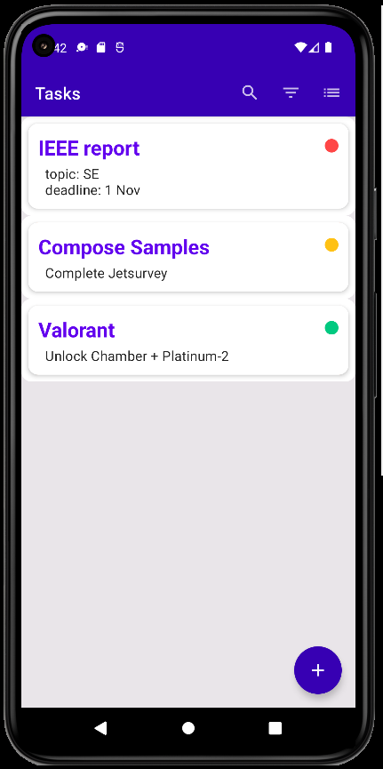
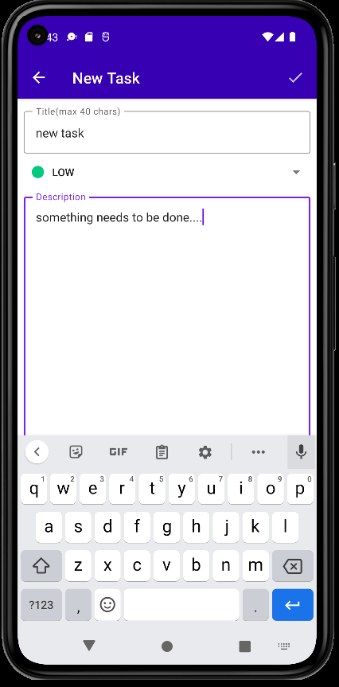
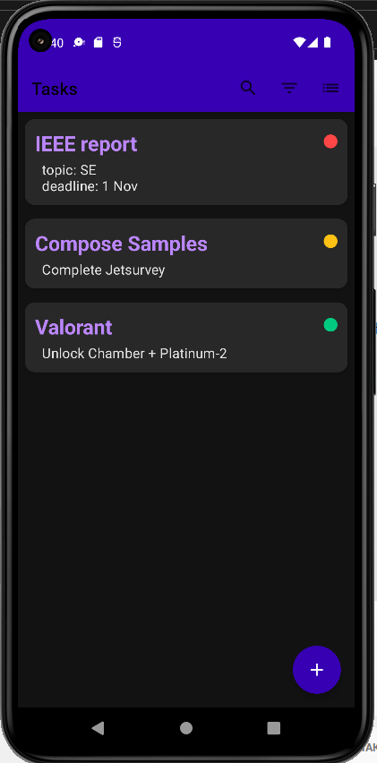
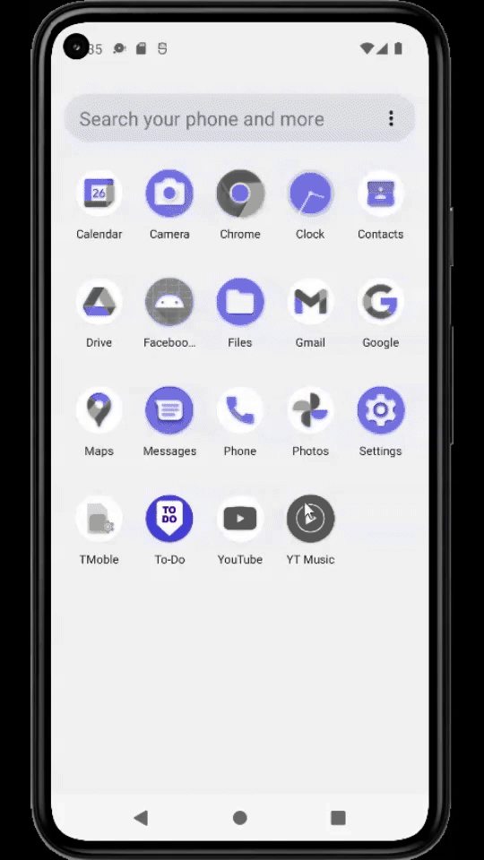
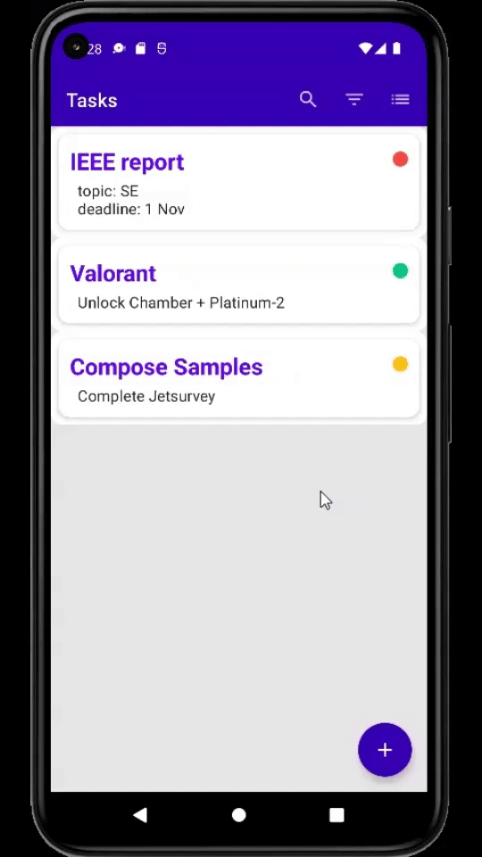

# todo-app
Simple todo app using Jetpack Compose and Kotlin. Supports login using Google(Fireabse)
# To-Do
[To-Do](https://github.com/hey-sameer/todo-app) is an Android app designed to keep track of errands or tasks that need to be completed. This application will function similarly to a task manager, allowing the user to enter the tasks that they need to complete. They can also remove themselves from the list once they have completed their tasks.

It is a single activity multiple screen app where instead of fragments and nav-graphs it used compose navigation. to It offers a animated splash screen, user-authentication using Google Firebase(OneTap Signin). Besides simple crud functionality on tasks created, you can set priority levels to each task and sort them based on it. It also offers a search feature and swipe-to-delete. It also has dark mode.

Technology used: Kotlin, Compose UI Toolkit, Compose Navigation, Room Database, Dagger-Hilt

&nbsp;&nbsp;&nbsp;&nbsp;&nbsp;
&nbsp;&nbsp;&nbsp;&nbsp;&nbsp;
 &nbsp;&nbsp;&nbsp;&nbsp;&nbsp;
&nbsp;&nbsp;&nbsp;&nbsp;&nbsp;

